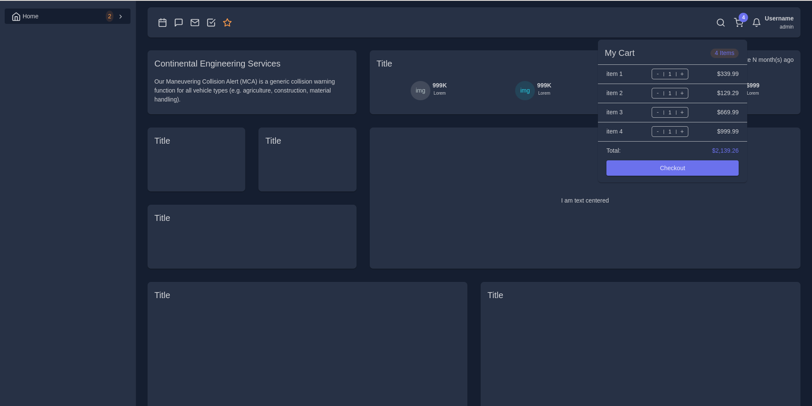
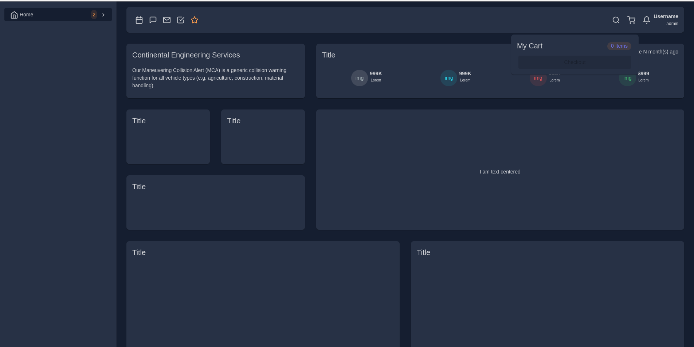
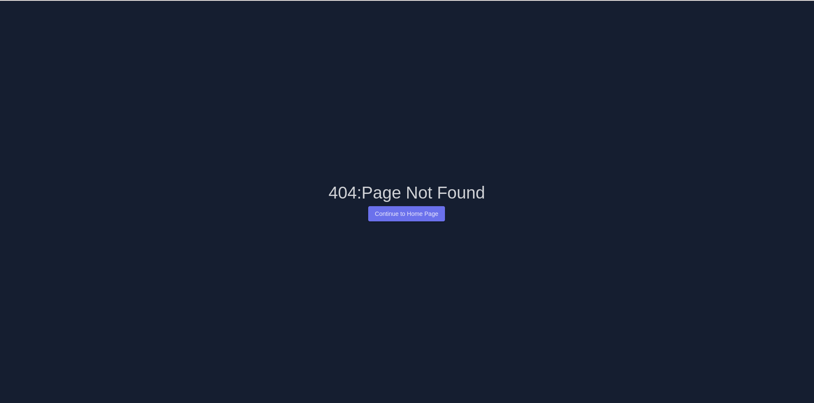

Run 'npm install' to install all packages.

## Development server

Run `npm run start` for a dev server. Navigate to `http://localhost:4200/`.

## Build

Run `ng build` to build the project.

## Below points are used and implemented:

1. **Angular material & Bootstrap**:- For designing the page.
2. **Implemented the NGRX state management**:- For making app better reactive to/from the data.
3. Iconify: For using the icons in the app.
4. **Angular theming**: For setting the standard color globally and use it more easily for developing.
5. Structured the folders according to the feature and shared components & dividing the modules for **Lazy loading**.
6. **Created a 404 not found page**, if any other url path used for example: 'http://localhost:4200/89'.
7. Used prettier for code formatting.
8. Used eslint for code quality.

## Screenshots

Desktop size dasboard:

Desktop size dasboard: Shopping cart is filled with list item:

Desktop size dasboard: After checkout the list is empty and shows an alert message 'The payment is finished successfully':

Mobile size dashboard:

Tablet size dashboard:

Page Not found:

